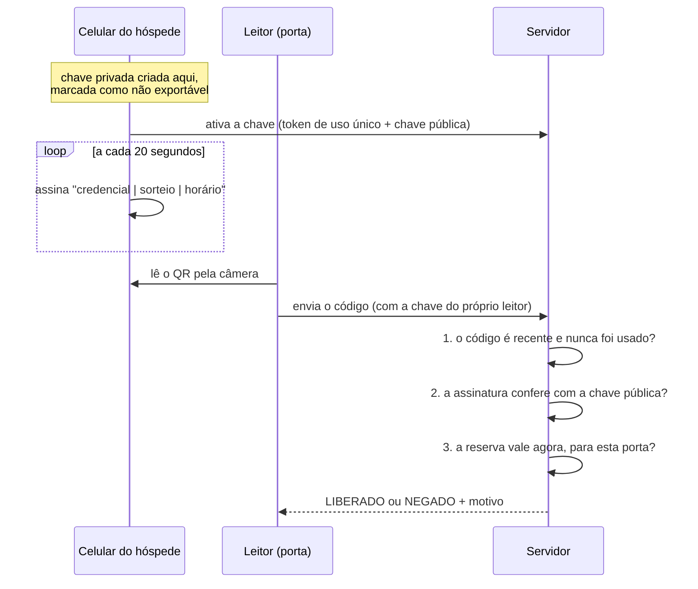

# SmartKey

Chave digital temporária para hospedagens. Cada reserva gera uma credencial que
abre **só as portas autorizadas**, **só durante a estadia**, e que pode ser
**revogada a qualquer momento**.

A chave vive no celular do hóspede e prova a identidade dele por **assinatura
digital** (ECDSA P-256): a chave privada é criada dentro do aparelho e nunca é
enviada a lugar nenhum. Um código capturado não serve para nada — cada um vale
por segundos e é aceito uma única vez.

---

## Sumário

- [Como funciona](#como-funciona)
- [Situação do projeto](#situação-do-projeto)
- [Início rápido](#início-rápido)
- [Configuração](#configuração)
- [API](#api)
- [Segurança](#segurança)
- [Testes](#testes)
- [Publicação](#publicação)
- [Estrutura do código](#estrutura-do-código)
- [Limitações conhecidas](#limitações-conhecidas)

---

## Como funciona



A decisão final fica numa única função pura,
[`AuthorizationEngine`](src/main/java/com/smartkey/domain/access/AuthorizationEngine.java),
que não acessa banco nem rede. Ela verifica, nesta ordem: leitor ativo →
credencial não revogada e reserva não cancelada → dentro do período → permissão
para esta porta → janela própria da permissão.

O período é `[check-in, checkout)`: com checkout às 11:00, 10:59:59 ainda abre e
11:00:00 já não abre.

Há dois canais, com a mesma criptografia:

| Canal | Quem sorteia o número único | Requer |
|---|---|---|
| **QR Code** (implementado) | o celular | qualquer navegador; iPhone e Android |
| **NFC** (backend pronto) | o leitor | dois apps Android nativos |

---

## Situação do projeto

| Fase | Entrega | Situação |
|---|---|---|
| 1 | Regras de acesso (horário, porta, revogação) | ✅ |
| 2 | Painel administrativo web | ✅ |
| 3 | Criptografia: desafio, assinatura, anti-repetição | ✅ |
| 4 | App do hóspede (PWA para Android e iPhone) | ✅ |
| 5 | App do leitor (PWA com câmera) | ✅ |
| 6 | Canal QR Code assinado | ✅ |
| 6b | Canal NFC — apps Android nativos com HCE | pendente |
| 7 | Testes completos, incluindo PostgreSQL real | ✅ |
| 8 | Publicação na nuvem | configuração pronta |
| 8b | Fechadura física com ESP32 | pendente |

---

## Início rápido

**Requisitos:** Java 21 ou superior e Maven. Não precisa de Docker nem de banco
de dados.

```bash
mvn spring-boot:run -Dspring-boot.run.profiles=demo
```

O modo `demo` usa um banco em memória e cria um cenário pronto: um hóspede com
estadia em andamento, quatro leitores e uma chave. O link de ativação e as
chaves dos leitores aparecem no console.

| Endereço | Para quê | Acesso |
|---|---|---|
| <http://localhost:8080/> | Painel administrativo | chave `demo123` |
| <http://localhost:8080/key.html#TOKEN> | Chave do hóspede | link do console |
| <http://localhost:8080/reader.html> | Leitor com câmera | `reader_apto_804` / `demo_reader_reader_apto_804` |
| <http://localhost:8080/swagger-ui.html> | Documentação da API | — |

Os dados somem ao encerrar a aplicação.

### Testar em celulares de verdade

A Web Crypto — que cria a chave privada no aparelho — **só existe em páginas
HTTPS** (ou `localhost`). Pelo IP da rede local ela não funciona. Use um túnel:

```bash
ngrok http 8080
```

> ⚠️ **Antes de expor o modo demo**, troque a chave de administração: `demo123`
> está escrita neste README e é pública. No PowerShell:
>
> ```powershell
> $env:ADMIN_API_KEY = "uma-chave-longa-e-aleatoria"; mvn spring-boot:run "-Dspring-boot.run.profiles=demo"
> ```

**Instalar na tela inicial** — iPhone: Safari → Compartilhar → *Adicionar à
Tela de Início*. Android: Chrome → menu → *Instalar app*.

O leitor com câmera exige o **Chrome no Android** (o Safari ainda não expõe a
leitura de QR para páginas web). A página oferece um campo manual como
alternativa.

### Com banco de dados real (Supabase)

As tabelas ficam isoladas no schema `smartkey`, acessadas por um usuário
dedicado **sem permissão nenhuma** sobre outros schemas — o banco pode ser
compartilhado com outro sistema sem risco.

1. No SQL Editor do Supabase, crie o usuário e o schema:
   ```sql
   CREATE USER smartkey_app WITH PASSWORD 'defina-uma-senha-forte';
   CREATE SCHEMA IF NOT EXISTS smartkey AUTHORIZATION smartkey_app;
   ```
2. Copie `src/main/resources/application-local.yml.example` para
   `application-local.yml` (ignorado pelo git) e preencha a conexão. Use a
   string do **Session pooler**: a conexão direta do plano gratuito é só IPv6.
3. Rode `mvn spring-boot:run`. O Flyway cria as tabelas na primeira execução.

---

## Configuração

Tudo é configurável por variável de ambiente. Os padrões são os **seguros**:
recursos de desenvolvimento vêm desligados.

| Variável | Padrão | Descrição |
|---|---|---|
| `DATABASE_URL` | — | JDBC do PostgreSQL, ex. `jdbc:postgresql://host:5432/postgres` |
| `DATABASE_USERNAME` / `DATABASE_PASSWORD` | — | credenciais do banco |
| `DB_SCHEMA` | `smartkey` | schema onde ficam as tabelas |
| `DB_POOL_SIZE` | `3` | conexões simultâneas ao banco |
| `ADMIN_API_KEY` | — | chave do painel. **Sem ela, ninguém é administrador** |
| `TRUSTED_PROXY_HOPS` | `0` | proxies à frente da aplicação: `1` no Render, `2` com Cloudflare |
| `CHALLENGE_TTL_SECONDS` | `60` | validade do desafio do canal NFC |
| `ENROLL_ATTEMPTS_PER_MINUTE` | `10` | tentativas de ativação por IP |
| `ALLOW_TIME_TRAVEL` | `false` | aceita o campo `at` para simular datas. **Só em desenvolvimento** |
| `ALLOW_INSECURE_CHECK` | `false` | liga `/api/access/check`, que dispensa assinatura. **Só em desenvolvimento** |
| `SEED_DEMO` | `false` | cria o cenário de exemplo com o banco vazio |
| `PORT` | `8080` | porta HTTP |

---

## API

Documentação interativa completa em `/swagger-ui.html`.

| Quem | Cabeçalho | Pode acessar |
|---|---|---|
| Administração | `x-admin-key` | tudo |
| Leitor | `x-reader-key` | apenas verificar acesso, e **apenas da própria porta** |
| Hóspede | — | ativar a própria chave (com o token do link) e desenhar o QR |

| Método e caminho | Acesso | Função |
|---|---|---|
| `POST /api/access/qr-verify` | leitor | verifica um QR assinado |
| `POST /api/access/challenge` | leitor | canal NFC, passo 1: pede um desafio |
| `POST /api/access/verify` | leitor | canal NFC, passo 2: envia a resposta assinada |
| `POST /api/keys/enroll` | público* | ativa a chave no celular (*exige o token de uso único) |
| `POST /api/keys/qr` | público | desenha um QR em SVG |
| `GET /api/health` | público | situação e hora do servidor |
| `/api/admin/**` | admin | hóspedes, reservas, aparelhos, leitores, credenciais |
| `GET /api/access/events` | admin | histórico de tentativas |

Motivos de recusa devolvidos em `reason`: `BEFORE_CHECK_IN`, `AFTER_CHECK_OUT`,
`DOOR_NOT_AUTHORIZED`, `CREDENTIAL_REVOKED`, `GRANT_REVOKED`,
`RESERVATION_CANCELLED`, `INVALID_SIGNATURE`, `CHALLENGE_ALREADY_USED`,
`CHALLENGE_EXPIRED`, entre outros — cada um com mensagem em português em
`message`.

---

## Segurança

Resumo do modelo. Detalhes, ameaças consideradas e histórico de auditoria em
[`docs/SEGURANCA.md`](docs/SEGURANCA.md).

- **Chave privada nunca sai do aparelho** — criada como não exportável (Web
  Crypto no navegador, Android Keystore no app nativo). O servidor guarda só a
  chave pública.
- **Anti-repetição garantida pelo banco** — cada código é gravado com o próprio
  sorteio como chave primária; a segunda apresentação é recusada numa única
  operação atômica, sem janela para condição de corrida.
- **Assinatura amarrada ao contexto** — o texto assinado inclui porta,
  credencial e um prefixo de protocolo; uma resposta capturada não serve em outra
  porta nem em outro canal.
- **Menor privilégio** — cada leitor tem chave própria, confinada à sua porta.
  Um leitor arrancado da parede não vira administrador.
- **Negar por padrão** — autorização central no Spring Security; qualquer
  endereço não liberado explicitamente é recusado.
- **Cabeçalhos de proteção** — Content-Security-Policy, `nosniff`,
  `X-Frame-Options`, `Referrer-Policy`, `Permissions-Policy`.
- **Limite de tentativas** por IP real (considerando só o IP acrescentado pelo
  proxy confiável, que o cliente não consegue forjar).

---

## Testes

```bash
mvn test
```

**99 testes**, nenhum dependendo de Docker, internet ou serviço externo.

| Suíte | Cobre |
|---|---|
| `AuthorizationEngineTest` | regras de horário, porta e revogação, incluindo os limites exatos |
| `SignatureVerifierTest` | assinaturas válidas, alteradas, de terceiros e de outra porta |
| `SecureAccessFlowTest` | canal NFC completo, repetição e adulteração |
| `QrAccessFlowTest` | canal QR, ativação da chave e ataques |
| `ReaderAuthTest` | chaves de leitor, escopo por porta, troca de chave |
| `RateLimitTest` | limite de tentativas e resistência a cabeçalho forjado |
| `SecurityHardeningTest` | regressão de cada vulnerabilidade já encontrada |
| `ApiIntegrationTest` | a API inteira por HTTP |
| `PostgresIntegrationTest` | **PostgreSQL real**: migrações, validação do esquema, anti-repetição no banco de produção |

O `PostgresIntegrationTest` executa um PostgreSQL de verdade, baixado como
dependência do Maven — é o que garante que as migrações funcionam antes do
primeiro deploy.

Os testes também rodam no GitHub a cada envio
([`.github/workflows/tests.yml`](.github/workflows/tests.yml)).

---

## Publicação

O [`render.yaml`](render.yaml) descreve o serviço no Render: ao conectar o
repositório, o serviço é criado com as variáveis certas e uma chave de
administração gerada automaticamente. O [`Dockerfile`](Dockerfile) é usado pelo
Render para compilar **na nuvem** — não é preciso Docker na sua máquina.

| Serviço | Papel | Observação do plano gratuito |
|---|---|---|
| Supabase | PostgreSQL | pausa após 7 dias sem uso |
| Render | a aplicação | dorme após 15 min; ~50 s para acordar |
| Cloudflare | domínio, TLS | ajuste `TRUSTED_PROXY_HOPS=2` se usado como proxy |

---

## Estrutura do código

```
src/main/java/com/smartkey/
├── domain/
│   ├── access/       decisão de acesso — código puro, sem banco nem rede
│   ├── crypto/       assinatura, formato do QR, chaves de API
│   ├── model/        entidades persistidas
│   └── enums/        estados e motivos de recusa
├── config/
│   └── security/     autenticação por chave e regras de autorização
├── service/          fluxos de acesso, ativação, administração e manutenção
├── repository/       consultas ao banco
└── web/              controllers, DTOs e tratamento de erros

src/main/resources/
├── db/migration/     migrações do Flyway (V1 a V5)
└── static/           painel, chave do hóspede e leitor
```

---

## Limitações conhecidas

- **Canal NFC** — o backend está pronto e testado, mas os dois apps Android
  nativos (hóspede com HCE e leitor) ainda não foram escritos.
- **O QR é desenhado no servidor.** O celular do hóspede assina localmente, mas
  precisa de conexão para exibir o código. Desenhar no próprio aparelho
  permitiria uso offline.
- **A fechadura depende do servidor.** Sem internet, nenhuma porta abre. Uma
  fechadura física (fase 8b) precisa validar credenciais localmente e receber
  revogações por sincronização.
- **Limite de tentativas em memória** — correto com uma instância (plano
  gratuito do Render). Com várias, precisa de armazenamento compartilhado.
- **Administração por chave única** — sem contas individuais, não há registro
  de *qual* administrador fez cada alteração. O painel guarda a chave no
  navegador.
